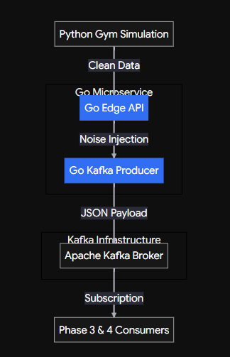

# OmniCell-AI Phase 1: Edge Ingestion & Raman Noise Telemetry Engine

## Module Overview

The **Edge Ingestion Engine** (`1_edge_ingestion`) is a high-throughput, low-latency telemetry processing microservice written in Go. In an industrial bioprocess facility, real-time measurements from Process Analytical Technology (PAT) instruments—such as in-situ Raman spectroscopy probes, biomass capacitance probes, and off-gas mass spectrometers—must be continuously ingested, calibrated, and broadcast to the messaging fabric without introducing backpressure on the plant DCS/SCADA network.

This module acts as the physical-to-digital bridge:
1. **HTTP Ingestion Endpoint:** Exposes a high-performance REST endpoint (`POST /telemetry`) receiving raw sensor observations from the physical or Software-in-the-Loop (SIL) bioreactor.
2. **Industrial Sensor Noise Injection:** Simulates genuine online Raman spectroscopy measurement noise by applying calibrated Gaussian jitter ($\sigma_{\text{biomass}} = 5\%$, $\sigma_{\text{glucose}} = 3\%$, $\sigma_{\text{lactate}} = 8\%$).
3. **Data Serialization & Transport:** Enriches raw readings with ISO-8601 timestamps and process state tags, then publishes directly to Apache Kafka (`omnicell-telemetry`).

---

## 🏛️ System Architecture



```text
    ┌───────────────────────────────────┐
    │ 2_simulation_env / Physical PAT   │
    │  (Biomass, Glucose, Lactate)      │
    └─────────────────┬─────────────────┘
                      │  HTTP POST /telemetry
                      ▼
    ┌───────────────────────────────────┐
    │        1_edge_ingestion           │
    │   [ HTTP Server (:8080) ]         │
    │                 │                 │
    │                 ▼                 │
    │   [ Raman Noise Simulator ]       │
    │   - Biomass: ±5% Gaussian Jitter  │
    │   - Glucose: ±3% Gaussian Jitter  │
    │   - Lactate: ±8% Gaussian Jitter  │
    │                 │                 │
    │                 ▼                 │
    │   [ Kafka Producer Pool ]         │
    └─────────────────┬─────────────────┘
                      │  JSON Payload
                      ▼
          Kafka: 'omnicell-telemetry'
                      │
       ┌──────────────┴──────────────┐
       ▼                             ▼
  [ 3_agent_swarm ]          [ TimescaleDB / Lakes ]
```

---

## 🔬 Data Models

### Input Payload (`IngestRequest`)
```json
{
  "biomass": 5.24,
  "glucose": 18.50,
  "lactate": 1.20
}
```

### Enriched Stream Message (`EdgePayload`)
```json
{
  "timestamp": "2026-09-03T21:40:00Z",
  "tank_id": "BIOREACTOR-01",
  "biomass_gL": 5.312,
  "glucose_gL": 18.421,
  "lactate_mmolL": 1.254,
  "status": "NOMINAL"
}
```

---

## 🚀 Running Instructions

### 1. Build and Run the Ingestion Engine
Ensure Kafka is running (`docker-compose up -d kafka`), then:

```powershell
cd 1_edge_ingestion
go run main.go
```

### 2. Run Test Suite
```powershell
go test -v ./...
```
